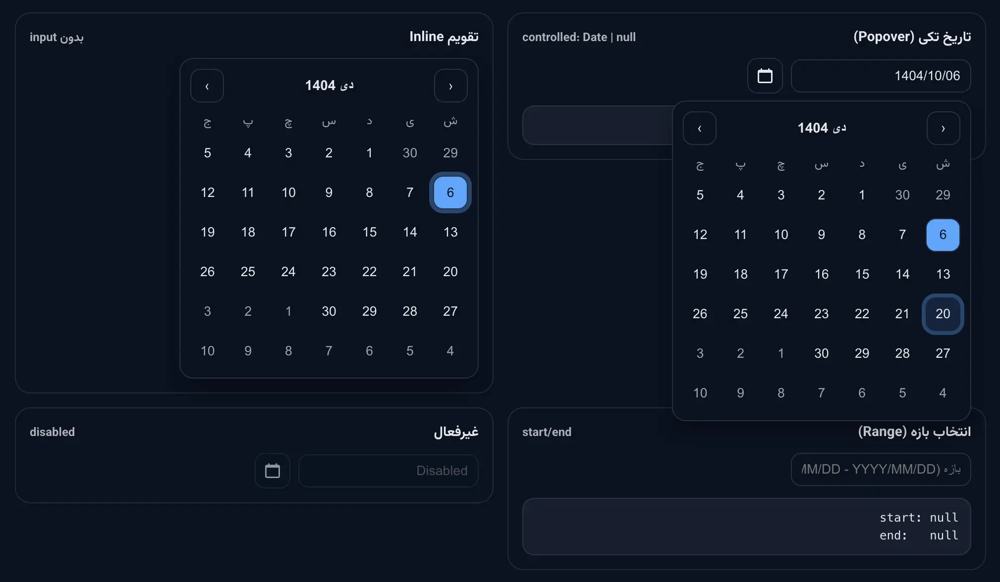

# persian-date-kit

Production-ready Persian (Jalali) date pickers for React.

[](https://github.com/aliseyedabady/darvix-persian-date-kit)

**Repository:** [https://github.com/aliseyedabady/darvix-persian-date-kit](https://github.com/aliseyedabady/darvix-persian-date-kit)

## Demo



## Key principles
- **Gregorian-only internally**: component values are always `Date | null` (Gregorian). Jalali is only for display/input.
- **Controlled components**: you own the state (`value` + `onChange`).
- **Logic separated from UI**: calendar grid/conversions are reusable utilities.
- **SSR-safe**: no `window` usage during render.
- **RTL-first**: `dir="rtl"` by default.
- **Optional styles**: ship CSS variables + minimal classes; you can override everything.

## Install

```bash
npm i persian-date-kit
```

## Styles (optional)
If you want the default look, import the stylesheet:

```ts
import 'persian-date-kit/styles.css'
```

If you skip it, you can style via your own CSS + the `classes` prop.

## Usage

### Single date picker

```tsx
import { useState } from 'react'
import { PersianDatePicker } from 'persian-date-kit'
import 'persian-date-kit/styles.css'

const monthLabels = [
  'فروردین',
  'اردیبهشت',
  'خرداد',
  'تیر',
  'مرداد',
  'شهریور',
  'مهر',
  'آبان',
  'آذر',
  'دی',
  'بهمن',
  'اسفند',
]

export function Example() {
  const [value, setValue] = useState<Date | null>(new Date())

  return (
    <PersianDatePicker
      value={value}
      onChange={setValue}
      placeholder="YYYY/MM/DD"
      monthLabels={monthLabels}
      weekdays={['ش', 'ی', 'د', 'س', 'چ', 'پ', 'ج']}
      minDate={new Date(2020, 0, 1)}
      maxDate={new Date(2030, 11, 31)}
    />
  )
}
```

### Inline calendar (no input)

```tsx
import { useState } from 'react'
import { PersianDatePicker } from 'persian-date-kit'

export function InlineCalendar() {
  const [value, setValue] = useState<Date | null>(new Date())
  return <PersianDatePicker mode="inline" value={value} onChange={setValue} />
}
```

### Range picker (start/end)

```tsx
import { useState } from 'react'
import { PersianDateRangePicker, type PersianDateRange } from 'persian-date-kit'

export function RangeExample() {
  const [range, setRange] = useState<PersianDateRange>({ start: null, end: null })

  return (
    <PersianDateRangePicker
      value={range}
      onChange={setRange}
      // inputVariant="two" (default) => two inputs
      inputVariant="single"
      placeholder="بازه (YYYY/MM/DD - YYYY/MM/DD)"
    />
  )
}
```

### Date picker with time

```tsx
import { useState } from 'react'
import { PersianDatePicker } from 'persian-date-kit'

export function DateTimeExample() {
  const [value, setValue] = useState<Date | null>(new Date())

  return (
    <PersianDatePicker
      value={value}
      onChange={setValue}
      placeholder="YYYY/MM/DD HH:mm"
      timePicker={{
        enabled: true,
        format: 'HH:mm',
        defaultTime: { hour: 12, minute: 0 },
        hourStep: 1,
        minuteStep: 5,
      }}
    />
  )
}
```

Or simply enable with defaults:

```tsx
<PersianDatePicker
  value={value}
  onChange={setValue}
  timePicker={true}  // Uses default time 00:00
/>
```

With seconds:

```tsx
<PersianDatePicker
  value={value}
  onChange={setValue}
  timePicker={{
    enabled: true,
    format: 'HH:mm:ss',
    showSeconds: true,
  }}
/>
```

### Multiple date selection

```tsx
import { useState } from 'react'
import { PersianDatePicker } from 'persian-date-kit'

export function MultipleSelectionExample() {
  const [dates, setDates] = useState<Date[]>([])

  return (
    <PersianDatePicker
      value={dates}
      onChange={setDates}
      multiple={true}
      maxSelections={5} // Optional: limit number of selections
    />
  )
}
```

### Custom calendar button

```tsx
import { Calendar } from 'lucide-react'

// Hide the calendar button
<PersianDatePicker
  value={value}
  onChange={setValue}
  showCalendarButton={false}
/>

// Use custom icon
<PersianDatePicker
  value={value}
  onChange={setValue}
  calendarIcon={<Calendar className="w-4 h-4" />}
/>
```

## React Hook Form (optional adapter)
The core package has **no required** form dependency.
If you want React Hook Form integration, import from the subpath:

```bash
npm i react-hook-form
```

```tsx
import { useForm } from 'react-hook-form'
import { RHF_PersianDatePicker } from 'persian-date-kit/react-hook-form'

type FormValues = { birthDate: Date | null }

export function RHFExample() {
  const { control, handleSubmit } = useForm<FormValues>({ defaultValues: { birthDate: null } })

  return (
    <form onSubmit={handleSubmit(console.log)}>
      <RHF_PersianDatePicker name="birthDate" control={control} placeholder="YYYY/MM/DD" />
      <button type="submit">Submit</button>
    </form>
  )
}
```

## Props reference

All values you receive in `onChange` are **Gregorian** (`Date | null`). Jalali is only used for display/input.

### `PersianDatePicker`

| Prop | Type | Default | Description |
|---|---|---:|---|
| `value` | `Date \| null \| Date[]` | — | Controlled value (**Gregorian**). Can be single date or array for multiple selection |
| `onChange` | `(date: Date \| null \| Date[]) => void` | — | Called with the next value (**Gregorian**) |
| `placeholder?` | `string` | `undefined` | Input placeholder (popover mode) |
| `multiple?` | `boolean` | `false` | Enable multiple date selection |
| `maxSelections?` | `number` | `undefined` | Maximum number of selectable dates (multiple mode) |
| `timePicker?` | `TimePickerConfig \| boolean` | `undefined` | Enable time picker (see **TimePickerConfig** below) |
| `showCalendarButton?` | `boolean` | `true` | Show/hide the calendar button |
| `calendarIcon?` | `React.ReactNode` | `undefined` | Custom calendar icon. If not provided, default icon is used |
| `classes?` | `PersianDatePickerClasses` | `undefined` | Per-slot class overrides (see **Classes table** below) |

### `PersianDateRangePicker`

| Prop | Type | Default | Description |
|---|---|---:|---|
| `value` | `{ start: Date \| null; end: Date \| null }` | — | Controlled range (**Gregorian**) |
| `onChange` | `(range: { start: Date \| null; end: Date \| null }) => void` | — | Called with the next range (**Gregorian**) |
| `inputVariant?` | `'two' \| 'single'` | `'two'` | Two inputs (start/end) or a single combined input |
| `placeholder?` | `string` | `undefined` | Placeholder for **single** input mode |
| `rangeSeparator?` | `string` | `" - "` | Separator used in single-input mode (`start{sep}end`) |
| `placeholderStart?` | `string` | `undefined` | Placeholder for start input (two-input mode) |
| `placeholderEnd?` | `string` | `undefined` | Placeholder for end input (two-input mode) |
| `classes?` | `PersianDateRangePickerClasses` | `undefined` | Per-slot class overrides (see **Classes table** below) |

### Shared props (`BasePickerProps`)

These props exist on both pickers:

| Prop | Type | Default | Description |
|---|---|---:|---|
| `minDate?` | `Date` | `undefined` | Minimum selectable day (**Gregorian**) |
| `maxDate?` | `Date` | `undefined` | Maximum selectable day (**Gregorian**) |
| `disabled?` | `boolean` | `false` | Disable interactions |
| `mode?` | `'popover' \| 'inline'` | `'popover'` | `inline` shows calendar without input |
| `theme?` | `'light' \| 'dark' \| 'auto'` | `'light'` | Default stylesheet theme (`auto` follows `prefers-color-scheme`) |
| `open?` | `boolean` | `undefined` | Control popover open state (popover mode) |
| `onOpenChange?` | `(open: boolean) => void` | `undefined` | Notified when open state changes (popover mode) |
| `popover?` | `PopoverConfig` | `{ portal: true }` | Popover positioning options (popover mode) |
| `formatValue?` | `(date: Date) => string` | built-in | Format input display (default: numeric Jalali `YYYY/MM/DD`) |
| `parseValue?` | `(text: string) => Date \| null` | built-in | Parse user text into **Gregorian** (default: numeric Jalali `YYYY/MM/DD`) |
| `weekdays?` | `string[]` | numeric | 7 weekday labels; if omitted, numeric labels are shown |
| `monthLabels?` | `string[]` | numeric | 12 month labels (index 0 => month 1); if omitted, month numbers |
| `renderMonthLabel?` | `(jy: number, jm: number) => React.ReactNode` | `undefined` | Custom header label renderer |
| `prevIcon?` | `React.ReactNode` | `undefined` | Custom previous icon |
| `nextIcon?` | `React.ReactNode` | `undefined` | Custom next icon |
| `className?` | `string` | `undefined` | Extra class on the root element |

### `TimePickerConfig`

| Prop | Type | Default | Description |
|---|---|---:|---|
| `enabled` | `boolean` | — | Enable time picker |
| `format?` | `'HH:mm' \| 'HH:mm:ss'` | `'HH:mm'` | Time format |
| `defaultTime?` | `{ hour: number; minute: number; second?: number }` | `undefined` | Default time when value is null (uses current time if not provided) |
| `showSeconds?` | `boolean` | `false` | Show seconds stepper (requires `format: 'HH:mm:ss'`) |
| `hourStep?` | `number` | `1` | Step size for hour increment/decrement |
| `minuteStep?` | `number` | `1` | Step size for minute increment/decrement |
| `secondStep?` | `number` | `1` | Step size for second increment/decrement |

**Note:** You can also pass `timePicker={true}` as a shorthand to enable with defaults.

### `PopoverConfig`

| Prop | Type | Default | Description |
|---|---|---:|---|
| `portal?` | `boolean` | `true` | Render popover in a portal (recommended for **modals/overflow** containers) |
| `gutter?` | `number` | `8` | Gap between anchor and popover |
| `padding?` | `number` | `8` | Minimum distance from viewport edges (clamping) |
| `strategy?` | `'fixed' \| 'absolute'` | `'fixed'` | Positioning strategy |
| `placements?` | `Array<'bottom' \| 'top' \| 'left' \| 'right'>` | `['bottom','top','left','right']` | Preferred placements order (auto-flip chooses best fit) |
| `align?` | `'start' \| 'center' \| 'end'` | `'end'` | Cross-axis alignment |

### Styling slots (`classes`)

You can override class names per slot:

| Slot | Used for |
|---|---|
| `root` | Root wrapper |
| `control` | Wrapper around input(s) (popover mode) |
| `input` | Input element |
| `button` | Clear button (single picker) |
| `popover` | Popover container |
| `header` | Calendar header |
| `navButton` | Navigation buttons (prev/next) |
| `monthLabel` | Header month/year label button |
| `grid` | Grid container |
| `weekday` | Weekday header cell |
| `day` | Day button |
| `dayOutside` | Day that belongs to adjacent month |
| `dayDisabled` | Disabled day |
| `dayToday` | Today day |
| `daySelected` | **Single picker** selected day |
| `dayInRange` | **Range picker** day inside range |
| `dayRangeStart` | **Range picker** range start day |
| `dayRangeEnd` | **Range picker** range end day |
| `timePicker` | Time picker container |
| `timeStepper` | Time stepper wrapper (hour/minute/second) |
| `timeStepperButton` | Stepper increment/decrement buttons |
| `timeStepperInput` | Time input field |
| `timeSeparator` | Time separator (`:`) |

## Styling / Theming

### 1) Use the default styles (recommended)

```ts
import 'persian-date-kit/styles.css'
```

The default CSS is built around **CSS variables**, so it’s easy to theme.

### 2) Theme via CSS variables (quickest)

These variables control most of the look:

| CSS variable | Purpose | Default (light) |
|---|---|---|
| `--dvx-pdp-bg` | Surface background | `#ffffff` |
| `--dvx-pdp-fg` | Main text | `#111827` |
| `--dvx-pdp-muted` | Muted text | `#6b7280` |
| `--dvx-pdp-border` | Borders | `#e5e7eb` |
| `--dvx-pdp-shadow` | Popover shadow | `0 10px 20px rgba(0, 0, 0, 0.08)` |
| `--dvx-pdp-accent` | Accent / selected | `#2563eb` |
| `--dvx-pdp-accentFg` | Text on accent | `#ffffff` |
| `--dvx-pdp-ring` | Focus ring | `rgba(37, 99, 235, 0.3)` |
| `--dvx-pdp-dayHover` | Hover background | `rgba(37, 99, 235, 0.08)` |

Example:

```css
.myPicker {
  --dvx-pdp-accent: #16a34a;
  --dvx-pdp-ring: rgba(22, 163, 74, 0.25);
}
```

```tsx
<PersianDatePicker className="myPicker" theme="light" value={value} onChange={setValue} />
```

### 3) Override per-slot classes (`classes` prop)

If you use Tailwind (or your own utility classes), pass overrides:

```tsx
<PersianDatePicker
  value={value}
  onChange={setValue}
  classes={{
    input: 'w-full rounded-xl border border-slate-300 bg-white px-3 py-2',
    popover: 'z-[9999]',
    daySelected: '!bg-emerald-600 !text-white',
  }}
/>
```

### 4) Fully custom CSS (no default stylesheet)

If you **don’t** import `styles.css`, you should provide your own CSS for the
component class hooks (ex: `.dvx-pdp`, `.dvx-pdp__input`, `.dvx-pdp__day`, ...),
or rely entirely on `classes` and your own styles.

### Styling approaches (summary table)

| Approach | What you do | Best for |
|---|---|---|
| Default styles | Import `persian-date-kit/styles.css` | Fastest start, good baseline |
| Theme variables | Override `--dvx-pdp-*` in your CSS | Brand theming without rewriting CSS |
| `classes` overrides | Pass Tailwind/utility classes via `classes` | Integrate into your design system |
| Full custom | Don’t import `styles.css`; write your own | Complete visual control |

## Development (this repo)

Clone the repository:

```bash
git clone https://github.com/aliseyedabady/darvix-persian-date-kit.git
cd darvix-persian-date-kit
npm install
```

Run development server:

```bash
npm run dev
```

Build for production:

```bash
npm run build
```

## Contributing

Contributions are welcome! Please feel free to submit a Pull Request.

## License

MIT © [Darvix](https://github.com/aliseyedabady/darvix-persian-date-kit)

---

_تقدیم به روح پاک پدربزرگ عزیزم_
